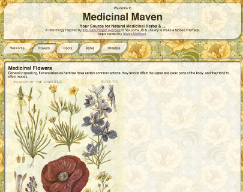

## A javascript tabbed pane type of thing

#### A simple implementation to flex some JS, JQuery, ...

- Idea from <a href="http://www.theodinproject.com/javascript-and-jquery/manipulating-the-dom-with-jquery" target="_blank">this Odin Project challenge.</a>

- Live preview [here](http://htmlpreview.github.io/?https://github.com/afshinator/js-tabbedPane/blob/master/index.html)

The idea was to create a menu using tabbed browsing instead of navigation that browsed you to separate pages.  

